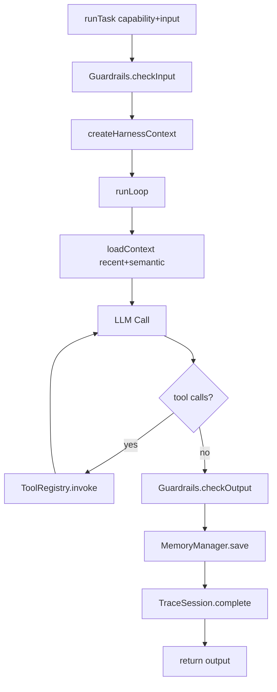

# Runtime Lifecycle

This page explains the full flow from `runTask()` to final output.

## 1. High-level flow

## 2. Key stages

### 2.1 Input guardrails

`ColonyHarness.runTask()` checks input first via `guardrails.checkInput(...)`.

### 2.2 Context assembly

`createHarnessContext()` wires model, loop, memory, and trace APIs.

### 2.3 Loop execution

`runLoop(prompt)` does:

1. load recent + semantic memory
2. call model with tool schemas
3. invoke tools and inject tool results into messages
4. stop by conditions and return `LoopResult`

### 2.4 Output checks and persistence

After task handler returns:

1. `guardrails.checkOutput`
2. persist episodic output memory
3. finalize trace and metrics

## 3. Useful metrics

- `loopIterations`
- `toolCallCount`
- `toolErrors`
- `inputTokens`
- `outputTokens`
