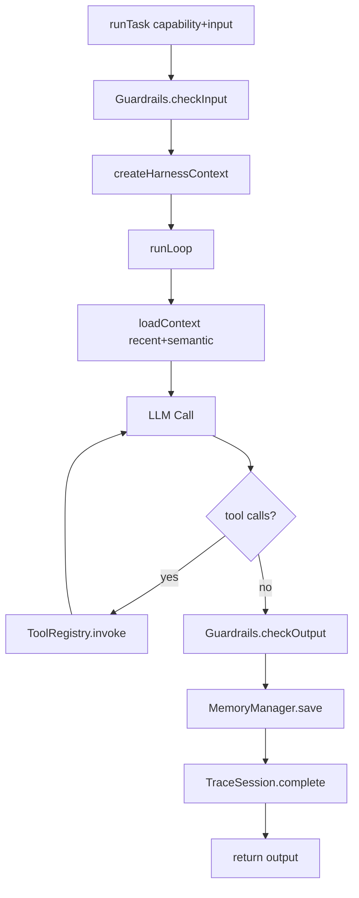

# 运行生命周期

本页解释一个任务从 `runTask()` 到最终输出的完整链路。

## 1. 高层流程

## 2. 关键阶段说明

### 2.1 输入护栏

`ColonyHarness.runTask()` 会先把输入转为字符串并执行：

- `guardrails.checkInput(textInput, { taskId, agentId, capability })`

如果命中拦截规则，直接抛 `GuardBlockedError`。

### 2.2 Context 构建

`createHarnessContext()` 会注入：

- 模型调用能力（`callModel`）
- loop 能力（`runLoop`）
- memory 能力（`save/load/search/recent/clearSession`）
- trace 能力（`startSpan/addEvent/setAttribute`）

### 2.3 Loop 执行

`runLoop(prompt)` 关键动作：

1. 先加载记忆（recent + semantic）并拼入 system prompt
2. 每轮调用模型时注册工具 schema
3. 如模型返回 tool calls，则调用工具并把结果回注消息
4. 满足停止条件后返回 `LoopResult`

### 2.4 自动压缩

在 `beforeModelCall` hook 内，会执行 `maybeCompressMessages()`：

- 当上下文 token 超过 `workingMemoryTokenLimit` 时触发压缩
- 压缩前后会发出 `memory:compressed` 事件

### 2.5 输出护栏与持久化

任务 handler 返回后：

1. 执行 `guardrails.checkOutput`
2. 把最终输出写入 episodic memory
3. 完成 trace（包含 metrics/spans/messages）

## 3. 你会拿到哪些可观测数据

- `loopIterations`
- `toolCallCount`
- `toolErrors`
- `inputTokens`
- `outputTokens`

## 4. 常见调优点

- loop 太长：降低 `maxIterations`，或增加 stop condition
- token 过大：调小 `workingMemoryTokenLimit`
- 模型网络抖动：`modelFailStrategy` 设为 `retry`，并调整 `modelRetryMax` / `modelRetryBaseDelayMs`
- 外部服务持续异常：开启 `modelCircuitBreakerEnabled`，并设置 `modelCircuitBreakerFailureThreshold` / `modelCircuitBreakerCooldownMs`
- 工具易失败：`toolFailStrategy` 设为 `retry` 并调 `toolRetryMax`
